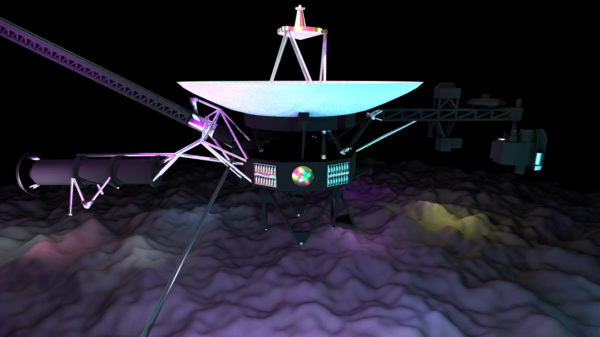

# rtcamp10
This repository contains the renderer submitted to [rtcamp10](https://sites.google.com/view/rtcamp10).

## Submission
[[Video](submission/video.mp4)] [[Slides](submission/alpine.pdf)] [[Seminar Slides](submission/LightSamplerComparison.pdf)]
- CPU
- Resolution: 1280x720
- Samples: 64
- FPS: 30
- Duration: 4s
- Lights: 64 (Point lights only)

## Build
Follow the [build instructions](https://github.com/ms-elk/alpine/tree/5ee73b8dacd292825c403c0cb8764eb9b495e496?tab=readme-ov-file#build) for `alpine`, but run CMake in the root directory of `rtcamp10` instead of `alpine`.

## Implementation
`main.cpp` was implemented based on [rtcamp10_setup](https://github.com/shocker-0x15/rtcamp10_setup/tree/main/samples/cpu_renderer)
